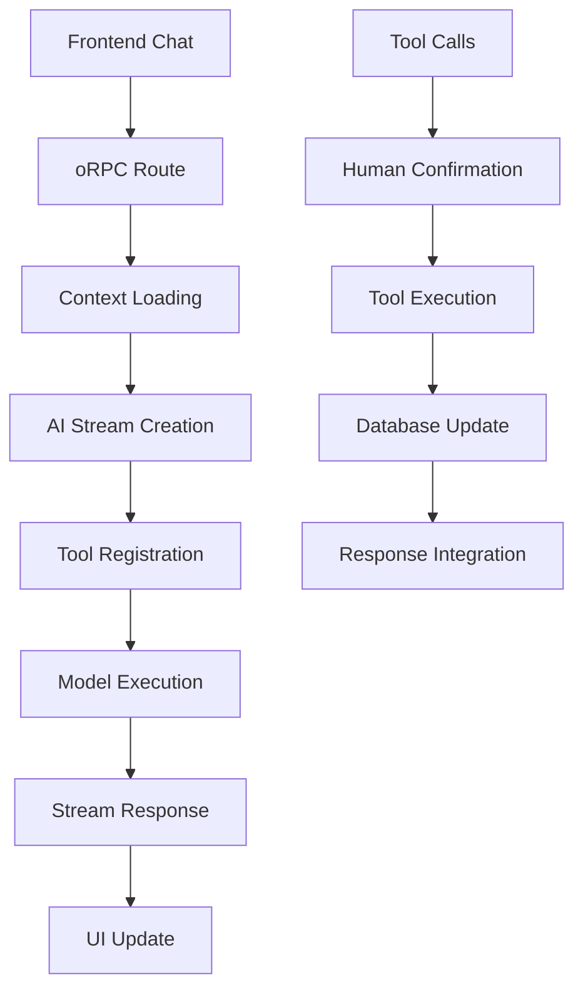

# Arquitetura da IA

## Visão Geral

O Tony Travel integra inteligência artificial através do **Vercel AI SDK v5** com **OpenRouter** como provedor de modelos, criando um sistema de assistente de viagem inteligente e contextualizado. A arquitetura foi projetada para garantir controle humano total sobre todas as ações da IA.

## Componentes Principais

### 1. Provedor de IA (OpenRouter)

```typescript
// src/orpc/modules/concierge/concierge.ai.ts
const openrouter = createOpenRouter({
  apiKey: serverEnv.OPENROUTER_API_KEY,
});
```

**Características:**
- **Modelo Padrão**: Google Gemini 2.0 Flash Lite 001
- **Flexibilidade**: Suporte a múltiplos modelos através do OpenRouter
- **Configuração**: Centralizada no ambiente servidor
- **Rate Limiting**: Controlado pelo provider

### 2. Stream de Conversa

```typescript
export function createConciergeStream(
  input: ConciergeChatStreamInput,
  tripContext: TripContext,
  db: DB,
) {
  const tools = createConciergeTools(db, tripContext);
  const CONCIERGE_SYSTEM_PROMPT = generateConciergeSystemPrompt(
    tools,
    tripContext,
  );
  
  const result = streamText({
    model: openrouter("google/gemini-2.0-flash-lite-001"),
    system: CONCIERGE_SYSTEM_PROMPT,
    messages: convertToModelMessages(input.messages),
    tools,
    stopWhen: stepCountIs(10),
  });

  return streamToEventIterator(result.toUIMessageStream());
}
```

**Recursos:**
- **Streaming Real-time**: Respostas progressivas para melhor UX
- **Context Injection**: Contexto da viagem automaticamente fornecido
- **Tool Integration**: Ferramentas disponíveis dinamicamente
- **Safety Limits**: Máximo de 10 passos por interação

### 3. Sistema de Contexto

```typescript
export interface TripContext {
  travelId: string;
  destination: string;
  startDate: string;
  endDate: string;
  travelers?: number;
  budget?: string;
  interests?: string[];
  specialRequests?: string;
}
```

**Funcionalidades:**
- **Context Awareness**: IA sempre ciente do contexto da viagem
- **Dynamic Loading**: Contexto carregado automaticamente do banco
- **Type Safety**: Interfaces TypeScript garantem consistência
- **Extensibilidade**: Fácil adição de novos campos contextuais

## Arquitetura de Dados

### Fluxo de Informações



### Integração com Backend

```typescript
// Exemplo de integração de ferramenta
function createConciergeTools(db: DB, tripContext: TripContext) {
  return {
    requestToCreateEvent: tool(new RequestToCreateEventTool(db, tripContext)),
    listEvents: tool(new ListEventsTool(db, tripContext)),
    getTravelParticipants: tool(new GetTravelParticipantsTool(db, tripContext)),
    getAccomodations: tool(new GetAccomodationsTool(db, tripContext)),
  } as const;
}
```

**Características:**
- **Database Access**: Cada ferramenta tem acesso direto ao banco
- **Context Injection**: Contexto da viagem disponível para todas as ferramentas
- **Type Safety**: TypeScript garante consistência entre tools
- **Modular Design**: Ferramentas facilmente adicionáveis/removíveis

## Segurança e Controle

### Princípios de Segurança

1. **Human-in-the-Loop Obrigatório**
   - Toda ação requer confirmação humana
   - Nunca execução automática de mudanças
   - Preview completo antes da confirmação

2. **Context Isolation**
   - Cada conversa isolada por viagem
   - Dados sensíveis não expostos desnecessariamente
   - Validação de permissões por usuário

3. **Input Validation**
   - Todas as entradas validadas com Zod
   - Sanitização automática de dados
   - Rate limiting implícito

### Controles de Execução

```typescript
// Limitação de passos para evitar loops infinitos
const result = streamText({
  // ... outras configurações
  stopWhen: stepCountIs(10),
});
```

## Performance e Otimização

### Estratégias de Cache

- **Context Caching**: Contexto da viagem cached por sessão
- **Tool Results**: Resultados de ferramentas podem ser cached
- **Model Responses**: Responses parciais mantidas em memória

### Streaming Optimization

```typescript
// Event iterator para streaming eficiente
return streamToEventIterator(result.toUIMessageStream());
```

**Benefícios:**
- **Low Latency**: Respostas começam a aparecer imediatamente
- **Progressive Enhancement**: UI atualizada incrementalmente
- **Error Handling**: Falhas não interrompem todo o fluxo
- **Cancel Support**: Usuário pode cancelar operações longgas

## Configuração e Environment

### Variáveis de Ambiente Necessárias

```bash
# Server Environment
OPENROUTER_API_KEY=seu_openrouter_api_key
```

### Configuração T3 Env

```typescript
// src/env.ts
import { createEnv } from "@t3-oss/env-core";

export const serverEnv = createEnv({
  server: {
    OPENROUTER_API_KEY: z.string().min(1),
  },
  // ...
});
```

## Monitoramento e Debug

### Logging da IA

- **Tool Execution**: Todas as execuções de ferramenta são logadas
- **Context Changes**: Mudanças de contexto rastreadas
- **Error Tracking**: Erros da IA capturados e reportados
- **Performance Metrics**: Tempo de resposta e uso de tokens

### Debug Tools

```typescript
// Console logs automáticos em desenvolvimento
if (process.env.NODE_ENV === 'development') {
  console.log('AI Context:', tripContext);
  console.log('Available Tools:', Object.keys(tools));
}
```

## Limitações e Considerações

### Limitações Técnicas

1. **Token Limits**: Modelos têm limites de contexto
2. **Rate Limiting**: OpenRouter impõe limites de requisições
3. **Network Dependency**: Requer conexão estável com OpenRouter
4. **Model Availability**: Dependente da disponibilidade do modelo

### Considerações de UX

1. **Latência**: Streaming minimiza percepção de lentidão
2. **Error States**: UI deve lidar com falhas graciosamente
3. **Offline Support**: Sistema degrada graciosamente sem IA
4. **Cost Awareness**: Usuários devem estar cientes do uso

## Extensibilidade

### Adicionando Novos Modelos

```typescript
// Facilmente configurável por environment ou user preference
const model = openrouter(userPreferences.model || "google/gemini-2.0-flash-lite-001");
```

### Novos Tipos de Contexto

```typescript
interface TripContext {
  // Campos existentes...
  dietary_restrictions?: string[];
  accessibility_needs?: string[];
  budget_limits?: {
    total: number;
    per_day: number;
  };
}
```

### Integração com Outros Providers

A arquitetura permite fácil substituição ou adição de outros providers AI mantendo a mesma interface de ferramentas e contexto.