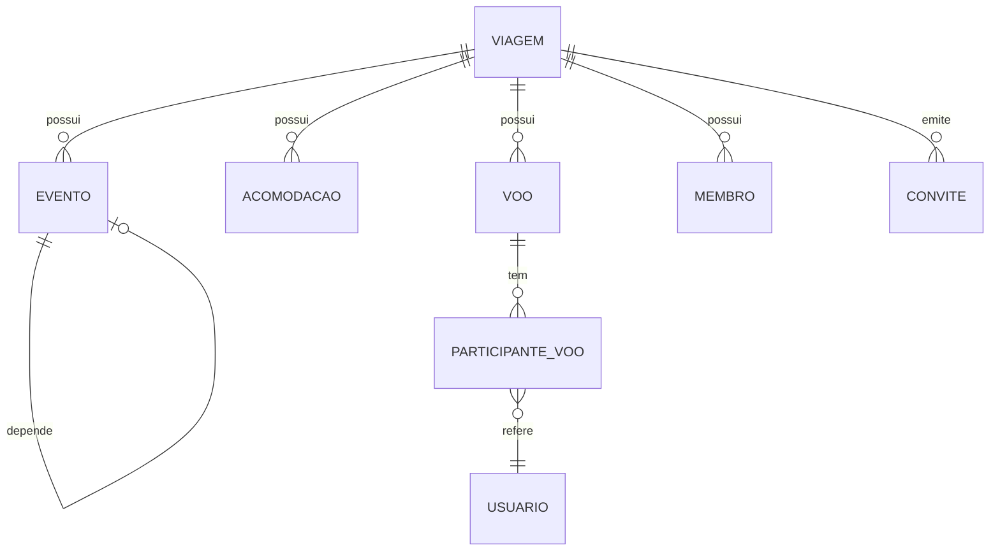

# Entidades de Domínio e Relacionamentos

Visão de alto nível das principais entidades, seus propósitos e relações. Não inclui detalhes de implementação.

Entidades principais:
- Viagem (Travel)
  - Campos conceituais: nome, descrição, destino, data início/fim, orçamento, estimativa de pessoas.
  - Agrega: Eventos, Voos, Acomodações, Membros, Convites.
  - Regras chave: datas válidas; soft delete; alterações restritas ao Owner.
- Membro (TravelMember)
  - Papel: "owner" ou "member" na viagem.
  - Pertence a uma Viagem e referencia um Usuário.
- Convite (TravelInvitation)
  - Token único, ativo/inválido, expiração opcional; criado por um usuário.
  - Permite ingresso de novos membros na Viagem.
- Evento (AppEvent)
  - Campos: título, início/fim, tipo (travel/food/activity), custo/estimativa, local.
  - Pode ter dependências (parentEventId): eventos filhos compõem o todo (timeline/custo).
- Acomodação (Accommodation)
  - Hospedagem com período (check‑in/out), endereço e preço.
  - Pertence a uma Viagem.
- Voo (Flight)
  - Origem/destino, datas/horários, custo.
  - Participantes do voo (FlightParticipant) referenciam usuários.

Relacionamentos (resumo):
- Viagem 1—N Eventos | Acomodações | Voos | Membros | Convites
- Evento N—1 Viagem; Evento pode referenciar Evento pai (dependência)
- Voo N—1 Viagem; Voo 1—N Participantes; Participante N—1 Usuário
- Acomodação N—1 Viagem

Diagrama conceitual (Mermaid, opcional em renderizadores):

Veja também: [03-processos.md](./03-processos.md), [04-regras-de-negocio.md](./04-regras-de-negocio.md)

Backreferences: [00-visao-geral.md](./00-visao-geral.md), [01-vocabulario.md](./01-vocabulario.md)
