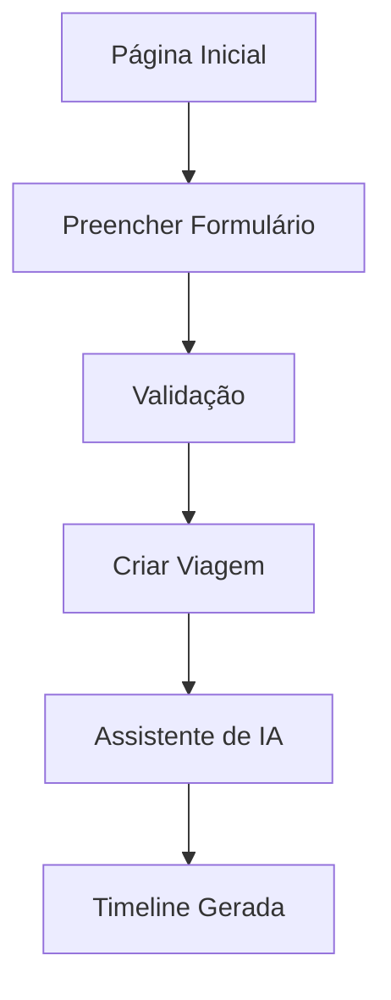
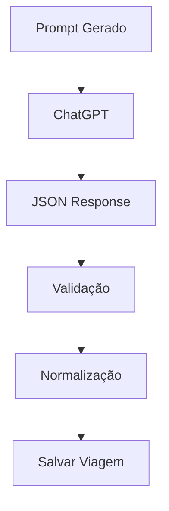
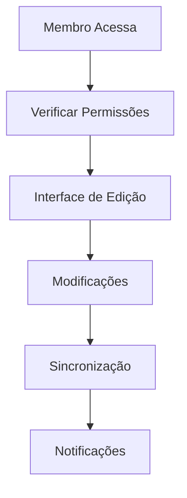

# Gestão de Viagens

## Visão Geral

O sistema de gestão de viagens do Tony Travel permite que usuários criem, personalizem e gerenciem roteiros de viagem de forma colaborativa. A plataforma oferece desde criação automatizada através de IA até controle granular de todos os aspectos da viagem.

## Criação de Viagens

### Planejador Inteligente

A tela inicial oferece um formulário intuitivo para criação de viagens:

![Formulário de Criação de Viagem]
- **Aeroportos de Partida**: Seleção múltipla com busca inteligente
- **Destinos**: Múltiplos destinos suportados com validação geográfica
- **Datas**: Seletor de período com validação de datas futuras
- **Orçamento**: Entrada formatada em Real brasileiro (BRL)
- **Número de Pessoas**: Opções predefinidas ou valor personalizado

#### Características do Formulário:
- **Busca de Aeroportos**: Sistema de busca que inclui:
  - Códigos IATA (ex: GRU, JFK)
  - Nomes de cidades
  - Agrupamentos por estado
  - Filtros por país
- **Validação Inteligente**: Campos obrigatórios com feedback visual
- **Persistência**: Últimas seleções salvas no localStorage
- **Responsividade**: Interface adaptativa para mobile e desktop

### Viagens em Destaque

A página inicial exibe viagens públicas e sugestões baseadas em:
- **Completude do conteúdo**: Viagens com mais eventos e detalhes
- **Viagens do usuário**: Priorização de roteiros próprios incompletos
- **Relevância temporal**: Consideração de datas e sazonalidade

## Estrutura de Dados de Viagem

### Informações Básicas
```typescript
interface Travel {
  id: string;
  name: string;
  destination: string;
  destinationAirports: Array<{value: string, label: string}>;
  startDate: Date;
  endDate: Date;
  budget?: number;
  peopleEstimate?: number;
}
```

### Componentes da Viagem

#### 1. **Acomodações**
- Check-in e check-out automáticos
- Tipos: hotel, pousada, apartamento, etc.
- Geolocalização e endereços
- Custos e avaliações

#### 2. **Eventos e Atividades**
- Timeline cronológica
- Categorias: viagem, alimentação, atividade
- Duração e horários flexíveis
- Dependências entre eventos
- Custos estimados ou reais

#### 3. **Membros e Colaboração**
- Sistema de convites por link
- Permissões diferenciadas (proprietário/membro)
- Edição colaborativa em tempo real

## Fluxos de Trabalho

### 1. Criação Rápida


### 2. Importação via IA


### 3. Edição Colaborativa


## Funcionalidades Avançadas

### Gerenciamento de Destinos
- **Aeroportos Múltiplos**: Suporte a múltiplos aeroportos por destino
- **Agrupamentos Inteligentes**: 
  - Por estado (ex: "São Paulo - todos aeroportos")
  - Por cidade (ex: "Rio de Janeiro - SDU, GIG")
  - Por país para destinos internacionais

### Validação e Integridade
- **Datas Consistentes**: Eventos dentro do período da viagem
- **Orçamento Inteligente**: Conversão e formatação automática
- **Dependências**: Verificação de conflitos entre eventos

### Persistência e Backup
- **Auto-save**: Salvamento automático durante edição
- **Versionamento**: Histórico de mudanças (planejado)
- **Exportação**: Múltiplos formatos (JSON, PDF planejado)

## Interface do Usuário

### Design System
- **Componentes Shadcn**: UI consistente e acessível
- **Temas**: Suporte a modo claro e escuro
- **Responsividade**: Design mobile-first
- **Gradientes**: Efeitos visuais modernos com aurora

### Navegação
- **Breadcrumbs**: Navegação hierárquica clara
- **Tabs**: Organização por seções (timeline, acomodações, membros)
- **Modais Responsivos**: Interfaces adaptativas para diferentes tamanhos de tela

### Feedback Visual
- **Loading States**: Indicadores de progresso
- **Toasts**: Notificações de sucesso/erro
- **Validação**: Feedback em tempo real
- **Estados Vazios**: Instruções claras para primeiros passos

## Casos de Uso Comuns

### 1. Viagem Individual de Negócios
- Criação rápida com destino único
- Foco em acomodações e transporte
- Integração com calendário pessoal

### 2. Viagem em Grupo - Lazer
- Múltiplos destinos e atividades
- Colaboração entre membros
- Gerenciamento de orçamento compartilhado

### 3. Lua de Mel Romântica
- Eventos especiais e experiências
- Detalhamento de custos
- Planejamento antecipado

### 4. Mochilão com Flexibilidade
- Múltiplos destinos
- Orçamento controlado
- Adaptações durante a viagem

## Limitações e Considerações

### Limitações Atuais
- **Offline**: Funcionalidade requer conexão
- **Idiomas**: Interface apenas em português brasileiro
- **Moedas**: Suporte apenas para Real brasileiro
- **Timezones**: Tratamento básico de fusos horários

### Segurança e Privacidade
- **Autenticação**: Google OAuth obrigatório
- **Permissões**: Controle granular por viagem
- **Links de Convite**: Expiração automática em 7 dias
- **Dados Pessoais**: Conformidade com LGPD

### Performance
- **Otimização**: TanStack Query para cache inteligente
- **Lazy Loading**: Carregamento sob demanda
- **Paginação**: Para listas grandes (implementação futura)

## Integração com Outros Módulos

### Assistente de IA (Concierge)
- Acesso contextual a dados da viagem
- Sugestões personalizadas
- Criação automática de eventos

### Gestão Financeira
- Tracking de custos por categoria
- Relatórios de gastos
- Split de contas entre membros

### Sistema de Voos
- Integração com dados de aeroportos
- Sugestões de voos
- Monitoramento de preços